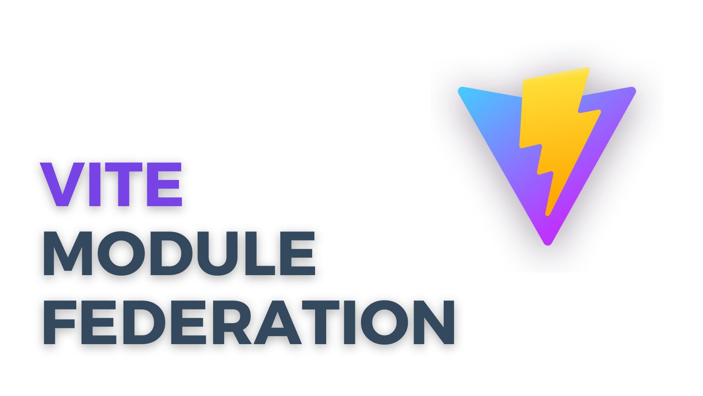

    
    <h1> Vite React-Rollup Apps Using Module Federation </h1>

There's a plugin that allow them to support **Module Federation**. They can
share code dinamically between two deployed applications.

There are two ways to share code between applications:

- **Built Time Sharing**: Code is integrated into applications during the build
process, resulting in a single bundled output that includes all shared
dependencies.
- **Runtime Sharing**: Code is shared while the application is running, allowing
different applications to load and use the same code dynamically without needing
to bundle it at build time.